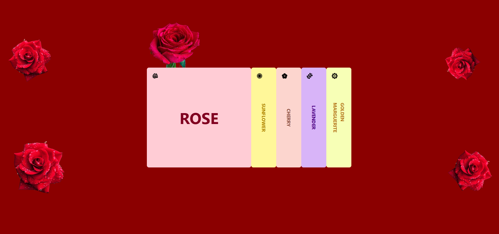
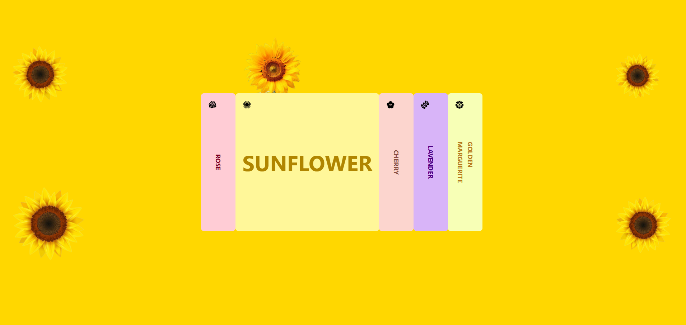

# 🌸 Blossom Collection

A visually captivating flower showcase built with React, Tailwind CSS, and GSAP animation. The project features a collection of beautifully styled flower cards with elegant transitions and interactive design.

## 🚀 Live Demo

👉 [Visit Blossom Collection](https://blossom-collection.netlify.app/)

## ✨ Features

- 🌼 Animated flower cards using GSAP
- 🎨 Unique pastel color theme for each flower
- 🌹 Rose-themed background for aesthetic appeal
- 🔄 Card expansion interaction on click
- 🌐 Fully responsive design (desktop/tablet/mobile)
- ⚡ Smooth transitions and performance-optimized UI

## 🔧 Tech Stack

- **React.js**
- **Tailwind CSS**
- **GSAP**
- **React Icons**

